## 미밴드를 이용한 수면 상태 채집과 패턴 예측

### 개요 및 배경

- 아침에 일어날 때 다른날보다 더 피곤하거나 더 상쾌한적이 있나요?
- 이러한 이유에는 사람의 수면상태에 따라 달라지는데 각성 상태와 렘수면(Repid Eye Movement Sleep) 상태, 비렘수면(Non-Repid Eye Movement Sleep) 상태로 나누어집니다.
- 렘수면의 경우 급속 눈 이동이라고 얕은 수면사태를 의미한다. 때문에 렘수면이 기상상태와 가장 가까운 수면상태를 의미한다.
- 따라서 사람은 기상할때 렘수면일 시에 상쾌하게 일어날 수 있다고 판단, 때문에 저는 렘수면시간대를 예측 할 수 있다면 알람을 조정해서 렘수면에 일어날 수 있는 어플을 만들 수 있을것이라고 생각했기 때문에 렘수면 시간대를 예측할 수 있는 인공지능을 학습시켜보고자 했습니다.

### 컬럼 선택

- 먼저 학습을 위해 해당 수면과 수면 상태를 확장자 csv형태로 기록후 학습을 시켰습니다.

- 하지만 컬럼이 한개인 상태로는 정확도를 올리기 어려웠고 사람이 잠이든 시간을 컬럼을 추가 시켰습니다.

- 온도를 추가시키고 싶지만 현재 시간에 대한 온도를 같이 기록하지 못했습니다.

- ```python
  sensor.plot('time', 'sleep_time', 'sleep')
  ```

- 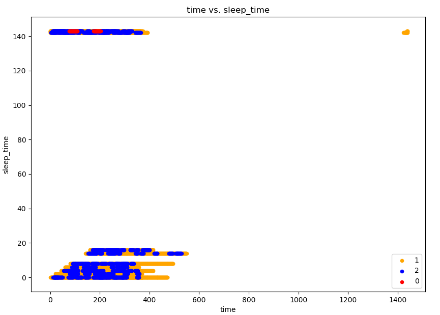

  - 먼저 그래프로 봤을때 밑에 time은 수면 상태에 대한 시간, sleep_time의 경우 잠든 시간으로 잠든 시간에 따라 시간에 대한 수명상태가 달라짐을 확인할 수 있습니다.
  
- ```pyhon
  sensor.heatmap()
  ```

- 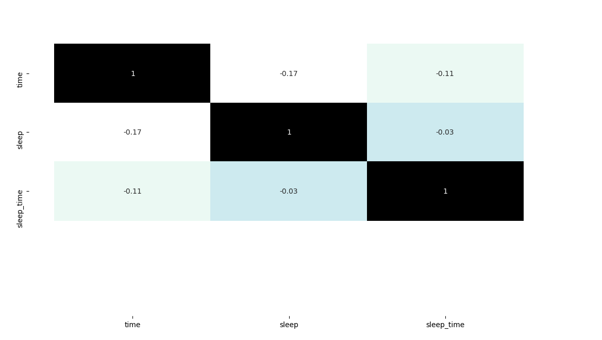
- 직접 데이터를 쓰다보니 다른 컬럼 추가가 힘들어져 주요 컬럼들만 표현을 했습니다.

### 데이터 불러오기

- 먼저 학습할려고 하는 데이터를 불러옵니다.

  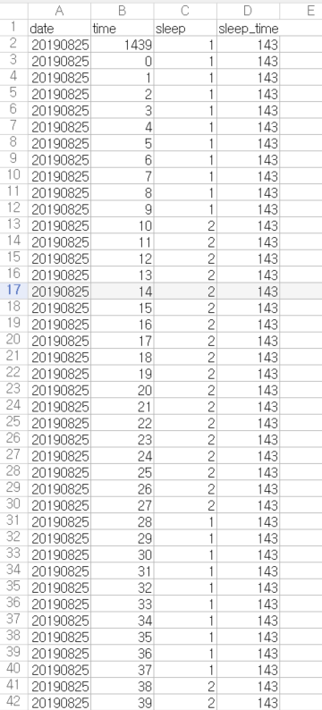

- 데이터의 경우 직접 기록한 것으로 미밴드에 있는 그래프를 보아 타이핑 한것입니다.
- 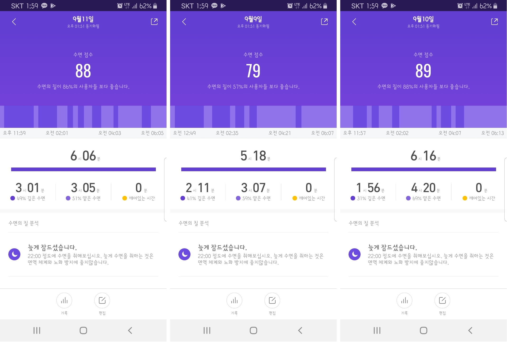
- 이러한 형태에서 각 시간마낟 깊은 수면과 얕은 수면을 알 수 있어 해당 날짜에 시간으로 작성했습니다.
- 잠든 시간의 경우 해당 날짜의 수면 시간중 가장 최초의 시간을 지정했습니다.

```python
from ai import from_sensor_code as code

sensor = code.MyClassifier();
sensor.read('sleepdata_v2.csv')
sensor.show()
```

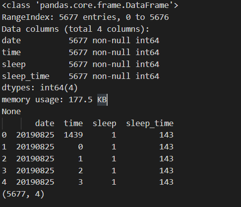

위와같이 데이터의 형태는 전부 int형이며 각 date는 채집한 날짜, time은 채집한 시간, sleep은 채집한 수면상태, sleep_time은 잠든 날짜입니다. 

위와 같은 형태로 총 5677개의 데이터를 기록했습니다.

### 인공지능 알고리즘 활용 학습 및 예측

#### SVM

- ```python
  sensor.run_svm(["time", "sleep_time"], "sleep")
  ```

  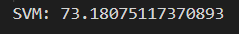

- SVM의 경우 정확도는 73퍼 정도의 평균을 보여준다.

#### Logistic_regression

- ```python
  sensor.run_logistic_regression(["time", "sleep_time"], "sleep")
  ```

  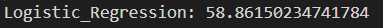

- 논리 회귀의 경우 58퍼 정도의 낮은 정확도를 보여준다.

#### Decision_tree

- ```python
  sensor.run_decision_tree_classifier(["time", "sleep_time"], "sleep")
  ```

  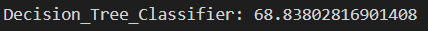

- 결정트리의 경우 평균 60점대 후반대로 나쁘지는 않지만 SVM보다는 우리 데이터에 잘 맞지 않음을 알 수 있다.

#### Kneighbor

- ```python
  for i in range(8):
      a = i+1
      print(a)
      sensor.run_neighbor_classifier(["time", "sleep_time"], "sleep", a)
  ```

  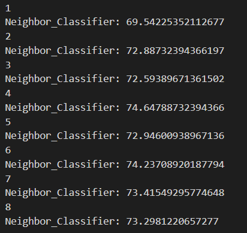

- 근접 이웃의 경우 이웃된 값을 1개를 제외한 나머지 의 경우 SVM 알고리즘의 정확도와 거의 비슷한걸 알 수 있다.

#### ALL

- ```python
  sensor.run_all(["time", "sleep_time"], "sleep", 4)
  sensor.draw_4_accuracy()
  ```

  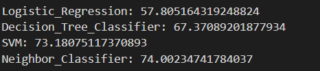

  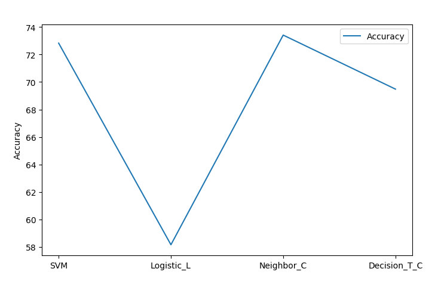

- 위에 있는 모든 알고리즘을 전부 돌린 결과 논리회귀와 결정 트리 알고리즘의 경우 근접 이웃과 SVM보다낮은 정확도를 보여준다.
